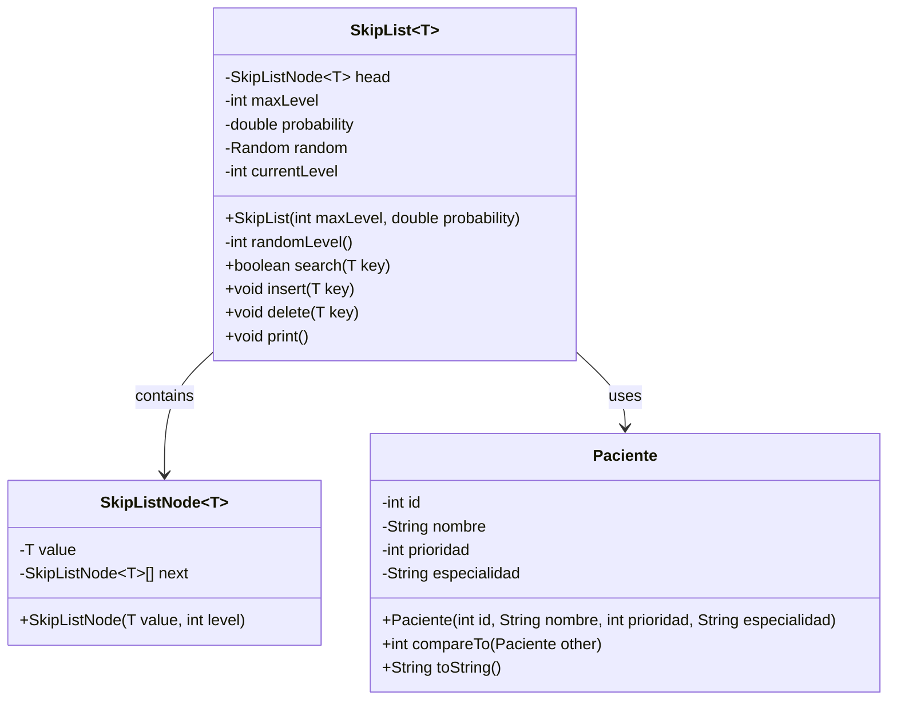
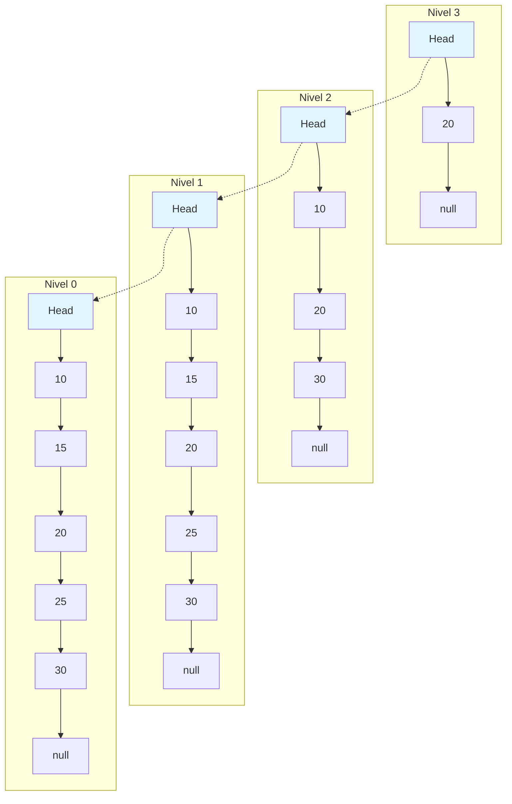
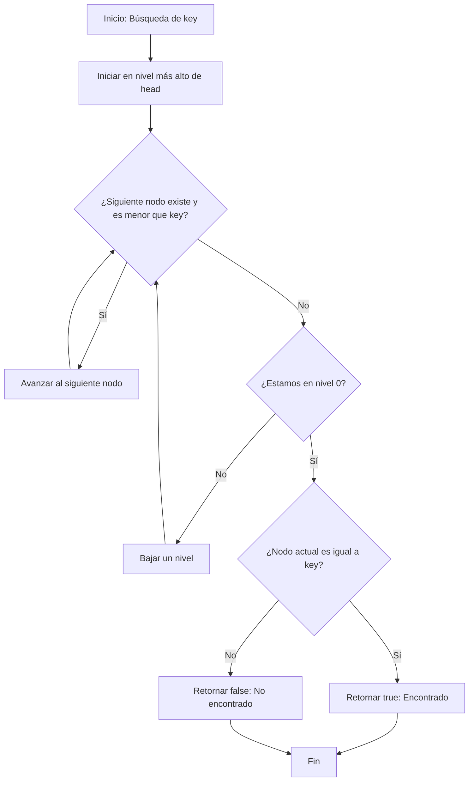
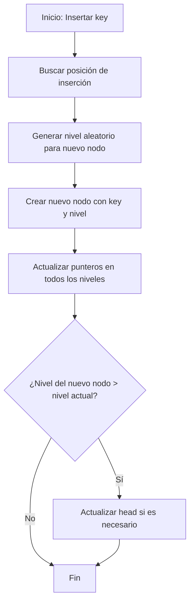
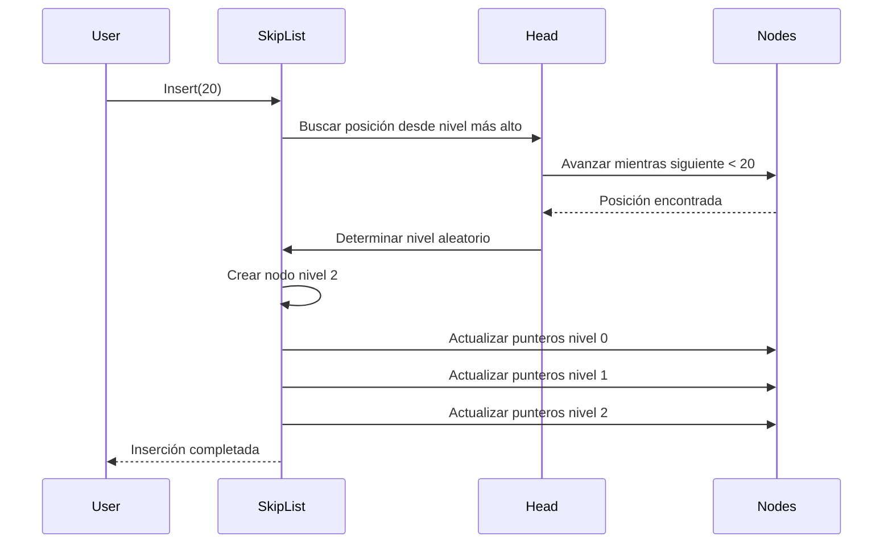
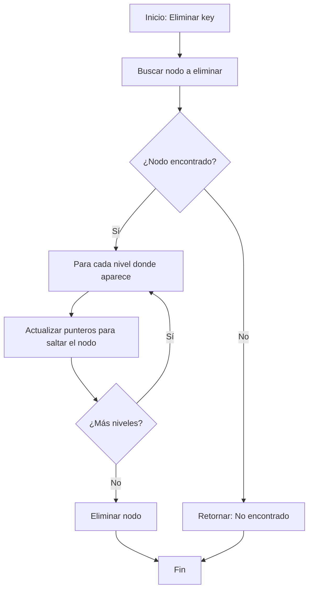
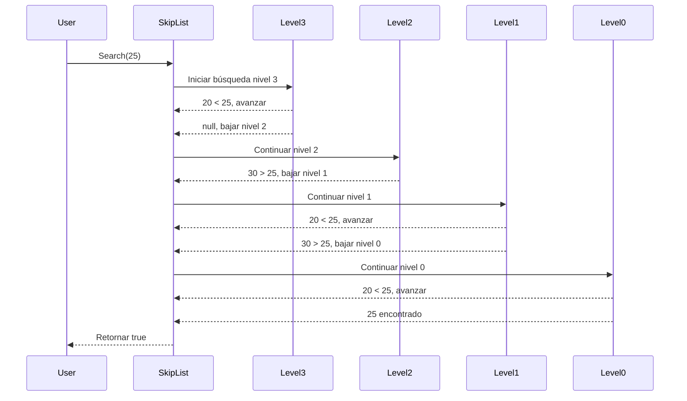
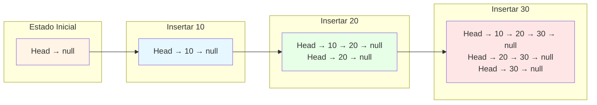
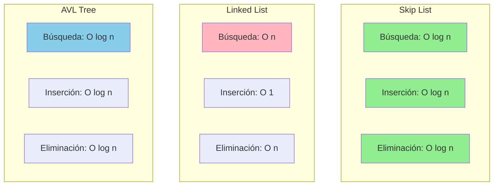
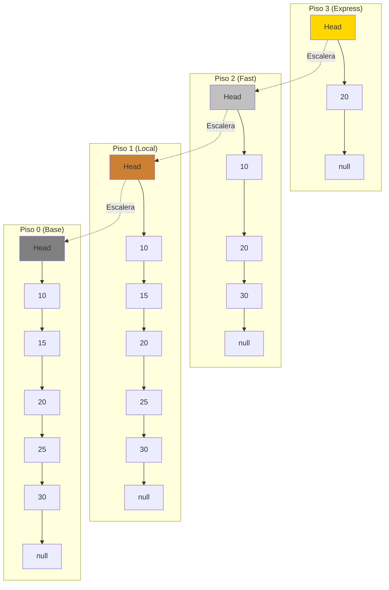

# Diagramas Mermaid - Skip List en Java

## Diagrama de Clases UML

## Estructura de Skip List

## Diagrama de Flujo - Búsqueda (Search)

## Diagrama de Flujo - Inserción (Insert)

## Diagrama de Secuencia - Inserción

## Diagrama de Flujo - Eliminación (Delete)

## Diagrama de Secuencia - Búsqueda

## Evolución de Skip List durante Inserciones

## Comparación de Complejidades

## Analogía del Edificio

