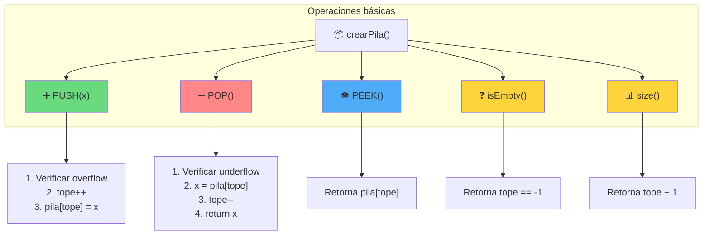

# ESTRUCTURA DE DATOS - LISTAS

Para realizar las practicas, seguir estos pasos:

1. Realizar la investigacion respectiva sobre al Estructura de Datos.

Ejemplo;

```mermaid
flowchart TD
    subgraph "Operaciones básicas"
        Create["📦 crearPila()"]
        Create --> Push
        Create --> Pop
        Create --> Peek
        Create --> IsEmpty
        Create --> Size
    end
    
    Push["➕ PUSH(x)"]
    Pop["➖ POP()"]
    Peek["👁️ PEEK()"]
    IsEmpty["❓ isEmpty()"]
    Size["📊 size()"]
    
    Push --> PushDetalle["1. Verificar overflow<br/>2. tope++<br/>3. pila[tope] = x"]
    Pop --> PopDetalle["1. Verificar underflow<br/>2. x = pila[tope]<br/>3. tope--<br/>4. return x"]
    Peek --> PeekDetalle["Retorna pila[tope]"]
    IsEmpty --> IsEmptyDetalle["Retorna tope == -1"]
    Size --> SizeDetalle["Retorna tope + 1"]
    
    style Push fill:#69db7e
    style Pop fill:#ff8787
    style Peek fill:#4dabf7
    style IsEmpty fill:#ffd43b
    style Size fill:#ffd43b
```

