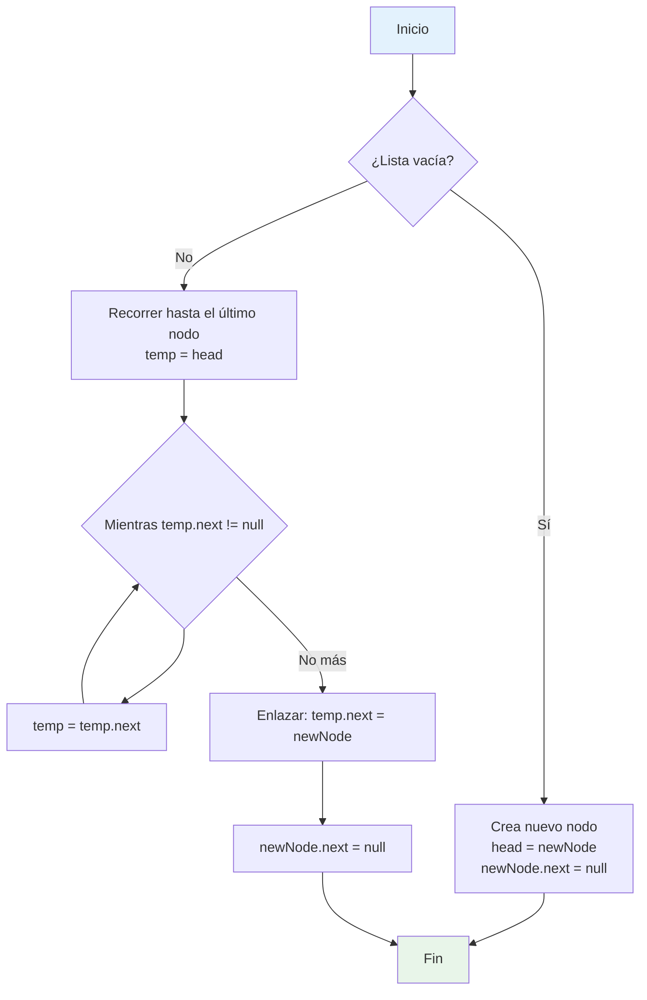

# Nomenclatura

1. Nombre de la rama

```
gquelali/practica01/001-lista-simple
```

1. Diagrama de la operación paso a paso (recomendado)


```mermaid
flowchart TD
    A[Inicio] --> B{¿Lista vacía?}
    B -- Sí --> C[Crea nuevo nodo<br>head = newNode<br>newNode.next = null]
    B -- No --> D[Recorrer hasta el último nodo<br>temp = head]
    D --> E{Mientras temp.next != null}
    E --> F[temp = temp.next]
    F --> E
    E -- No más --> G[Enlazar: temp.next = newNode]
    G --> H[newNode.next = null]
    C --> I[Fin]
    H --> I[Fin]

    style A fill:#e3f2fd
    style I fill:#e8f5e9
```