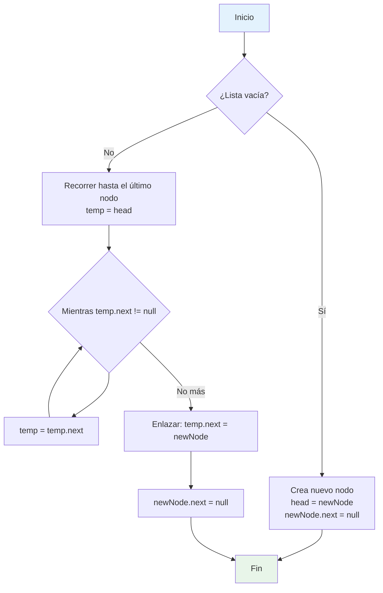
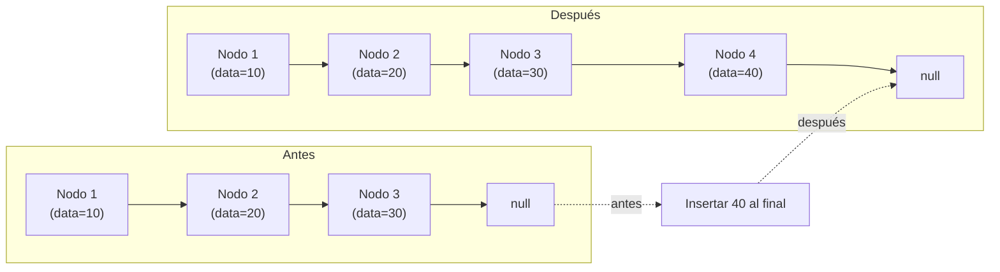
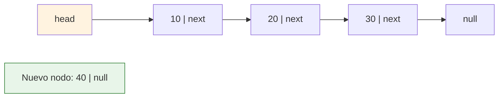

# Nomenclatura

1. Nombre de la rama

```
gquelali/practica01/001-lista-simple
```

1. Diagrama de la operación paso a paso (recomendado)



2. Representación visual de la lista antes y después



3. Versión más detallada con nodos individuales (estilo clásico)


